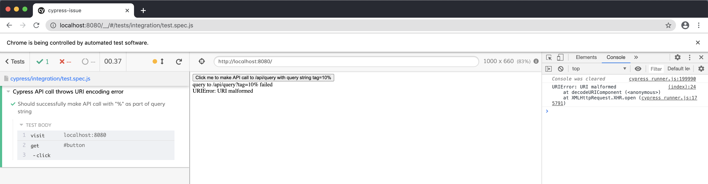
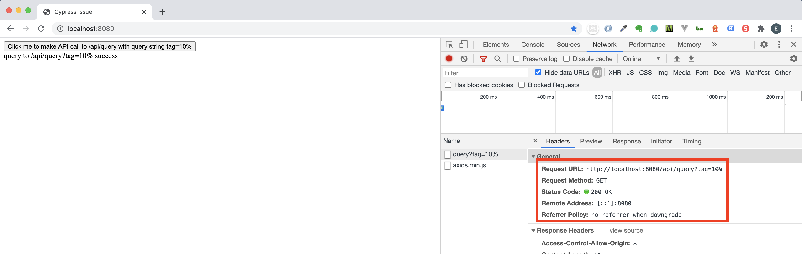

## Cypress throws `URI malformed` error when `GET` request with query string is made eg. `/api/query?tag=10%`

This repository reproduces error stated. Runs on `NodeJS` and requires `nodemon`.

Error when Cypress is run.



When the same action is executed on the browser, error does not happened.



---

### Steps to reproduce error

1. Install all dependencies:
```bash
npm install
```

2. Start NodeJS:
```bash
# required nodemon
npm run start
```

3. Start Cypress:
```bash
npm run cypress
```

4. Run `test.spec.js` file
